# RAG система с памятью

## Сбор корпуса и нарезка
В файле corpus_2026.jsonl находится корпус, который содержит в себе страницы википедии, ссылка на страницу и полный текст страницы. Изначальные данные для сбора корпуса содержатся в файле fresh_2026.jsonl. Корпус собран через fresh_2026.jsonl через запуск скрипта fetch_corpus.py.


Нарезку корпуса выполняли посимвольно (каждые 400 символов в отдельный чанк) и по строкам с трекингом заголовков (section) исходя из структуры документа (заголовки начинаются и заканчиваются несколькими знаками =, конечные знаки равно обрезаем). Если кусочек строки получился длиной больше 40, то кладём в массив чанков - полную страницу, заголовок, ссылка на страницу и сам получившийся чанк.

## График recall@k с разными вариантами нарезки и итоговая таблица
Посмотрим на график recall@k с различными вариантами разбивки и увидим, что выгодно взять k=3 или k=5 с разбивкой по строкам. Метрика показывает долю верных кусков, которые оказались среди первых топ-k кусков. Возьмём k=5 (для большего выбора при генерации ответа без потери качества по сравнению с k=3) с разбивкой по структуре документа (по строкам)


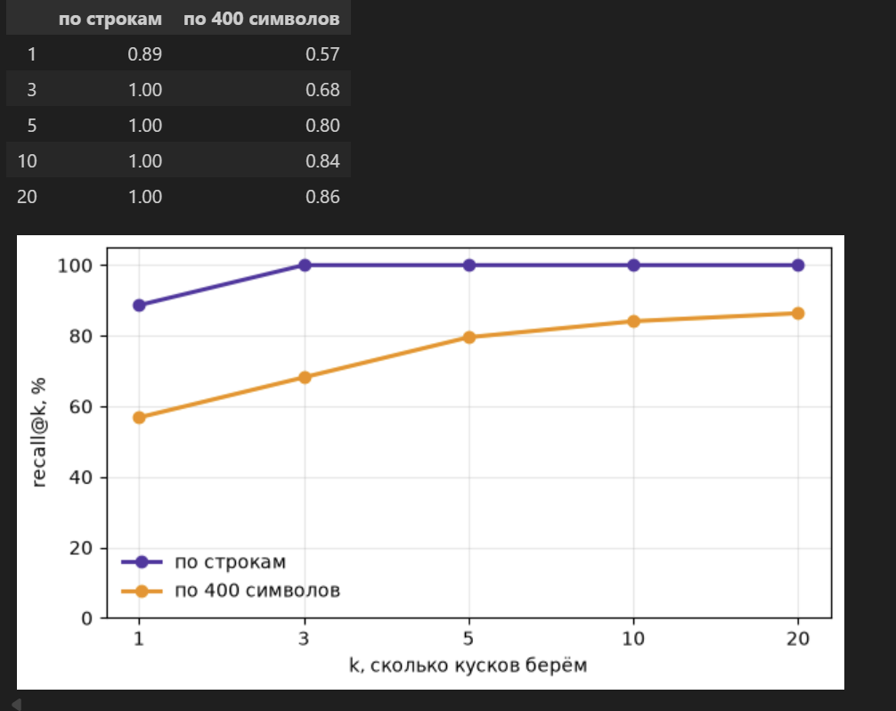


Посмотрим на гибридный поиск с RRF. 


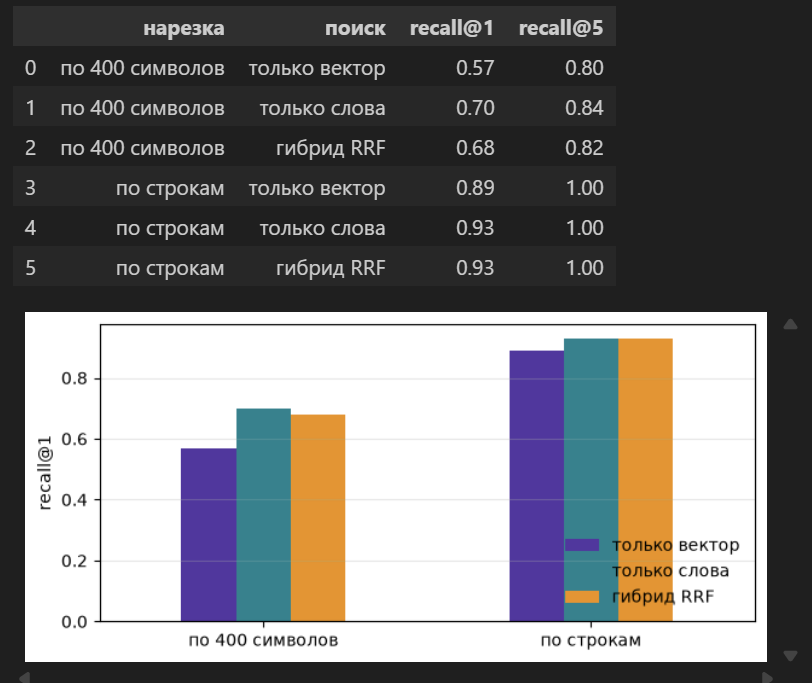


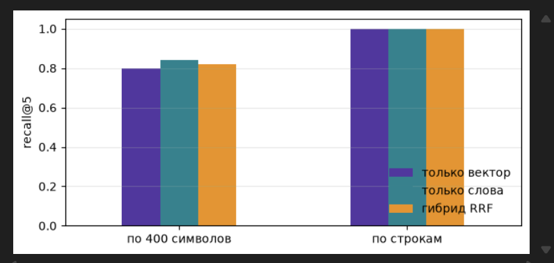


Видим,что гибридный поиск работает лучше всего на всех вариантах нарезки, наилучшее качество показывает на нарезке по строкам. При этом поиск только по словам в разбивке по строкам на k = 1 видим, что по recall@1 поиск по словам не уступил гибридному поиску. А на recall@5 видно, что что все варианты поиска показывают наилучший результат.

Обратим внимание,что при нарезке по символам гибридный поиск на k=1 и k=5 уступил поиску по словам. 


Посмотрим на итоговую таблицу наших моделей и агентов с knowledge_base. Таблица с результатами по каждой итерации и суммарными представлена в results_rag_and_agent_iteration.csv и summary_results_rag_and_agent.csv. Отметим, что результат с дешёвой моделью c живым поиском я взял заранее сохраненную из прошлых прогонов агента (из таблицы summary_table.csv)

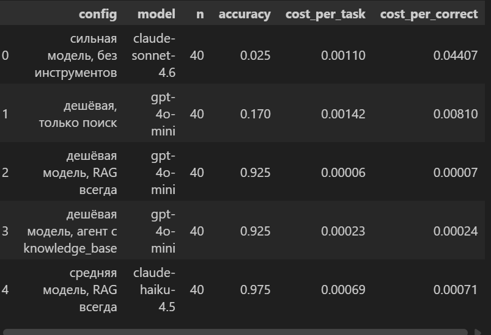

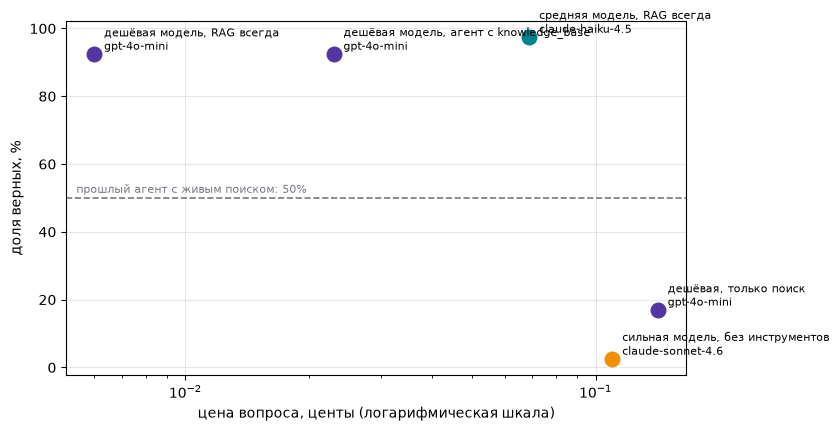

Согласно итоговой таблицы видно, что лучший результат и выше нашего baseline показала средняя модель с использованием RAG (точность 97.5%). Однако обратим внимание, что конфигурации дешевая модель с RAG и дешёвая модель с агентом и knowledge_base показали одинаковый результат 92.5%, но стоят дешевле средней модели с RAG. Особенно разница более в 10 раз для дешевой модели с RAG по сравнению со средней с RAG. Имеет смысл подумать критична ли разница в точности в 5%. Если нет, проще и дешевле взять дешевая модель gpt-4-0-mini с RAG.

Дешевая модель только с поиском показала низкую точность 17% и высокую стоимость, тоже самое сильная модель без инструментов показала низкую точность 2.5% и высокую стоимость. Агентский baseline показал 50% точность


## Разбор провалов
Посмотрим на отказы модели (неверные ответы), выберем конфигурации с RAG.


У RAG две половины, и ломаются они по-разному. Поиск мог не найти нужный кусок. А мог найти, но модель ответила неверно или отказалась. Чинятся эти случаи в разных местах, поэтому первым делом раскладываем ошибки на две кучки.

Дальше три приёма. Гибрид: вектор ловит смысл, поиск по словам ловит точные имена и числа, слияние рангов RRF берёт лучшее от обоих. Проверим его на обеих нарезках: и там, где вектору тяжело, и там, где он уже хорош. Отказ: десять вопросов, ответа на которые в корпусе нет, и подсчёт, сколько раз система честно сказала `NOT_FOUND`. Порог близости: у неотвечаемых вопросов лучший кусок заметно дальше, и это дешёвый сигнал для отказа ещё до вызова модели.

```python
def diagnose(results):
    wrong = results[~results["correct"] & results["config"].str.contains("RAG")]
    return wrong.groupby("model").agg(не_нашли=("found", lambda s: int((~s).sum())), нашли_но_ответ_неверный=("found", "sum"))

diagnose(results)
```

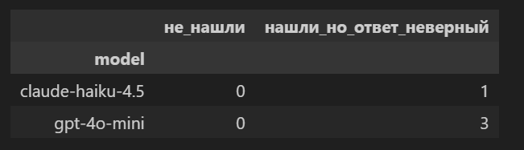

Видим, что модель claude-haiku-4.5 с RAG (средняя модель) нашла информацию из векторной бд Milvus, но ответ дала неверный в 1 кейсе

Дешёвая модель gpt-4o-mini в 3 случаях по найденной информации дала неверный ответ.

Посмотрим на кейс со средней моделью с RAG

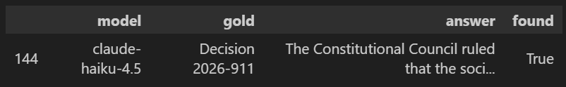

Видим, что модель нашла кусок, но сформулировала ответ неверно

Ещё один кейс с дешёвой моделью с RAG. Видим, что модель опять же нашла кусок, но неверно сформулировала ответ

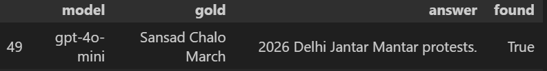

Теперь разберём один из отказов. Напомню, что отказы были заданы следующим образом:

```python
refusals = [rag_answer(q, MODELS["cheap"]) for q in UNANSWERABLE]
```

Вопросы, на которые нет ответа в корпусе были заданы здесь:

```python
UNANSWERABLE = [
    "Who won the 2026 Stanley Cup in the National Hockey League?",
    "Which city was selected to host the 2032 Summer Olympic Games?",
    "Who was awarded the Nobel Prize in Chemistry in October 2026?",
    "What was the name of the near-Earth asteroid that impacted the Earth in September 2026?",
    "Who won the Best Actor award at the 99th Academy Awards held in 2027?",
    "Which political party won the majority in the 2026 Mexican general election?",
    "What was the official global release date of the PlayStation 6 console in 2026?",
    "Who was appointed as the new Chief Executive Officer of Microsoft in 2026?",
    "What was the magnitude of the earthquake that struck Istanbul, Turkey in August 2026?",
    "Which national team won the 2026 Rugby World Cup?"]
```

Рассмотрим отказ на первый вопрос про то, кто выиграл кубок стэнли по хоккею в 2026

```python
refusals[0]
```
```python
{'answer': 'NOT_FOUND.  \nFINAL: NOT_FOUND.',
 'hits': [{'text': 'In ice hockey, the Carolina Hurricanes beat the Montreal Canadiens in five games during the Eastern Conference Finals to advance to the 2026 Stanley Cup finals, making it their first appearance in the Stanley Cup since 2006.',
   'page': '2026 in the United States',
   'section': 'May',
   'url': 'https://en.wikipedia.org/wiki/2026_in_the_United_States',
   'id': 3038,
   'score': 0.6343},
  {'text': 'In ice hockey, the Minnesota Wild defeat the Dallas Stars in six games in the 2026 Stanley Cup playoffs following a 5–2 victory to win a playoff series for the first time since 2015, ending an 11-year drought.',
   'page': '2026 in the United States',
   'section': 'April',
   'url': 'https://en.wikipedia.org/wiki/2026_in_the_United_States',
   'id': 2970,
   'score': 0.6298},
  {'text': 'April 4 – 2025–26 NHL season: In ice hockey, the Buffalo Sabres clinched the Stanley Cup playoffs for the first time since the 2010–11 season, ending their 14-year Stanley Cup playoff drought.',
   'page': '2026 in the United States',
   'section': 'April',
   'url': 'https://en.wikipedia.org/wiki/2026_in_the_United_States',
   'id': 2908,
   'score': 0.6078},
  {'text': '2026 World Junior Ice Hockey Championships: Canada defeats Finland 6-3, winning the bronze medal.',
   'page': '2026 in Canada',
   'section': 'January',
   'url': 'https://en.wikipedia.org/wiki/2026_in_Canada',
   'id': 506,
   'score': 0.5459},
  {'text': 'Canada wins its first gold medal at the 2026 Winter Paralympics.',
   'page': '2026 in Canada',
   'section': 'March',
   'url': 'https://en.wikipedia.org/wiki/2026_in_Canada',
   'id': 559,
   'score': 0.5373}],
 'cost': 5.0850000000000016e-05}
 ```
Видно,что модель нашла фрагменты, но после их анализа решила, что ответа на вопрос по ним дать невозможно и ответила NOT_FOUND


На гистограмме видно, что если ответа в корпусе нет, то близость лучшего куска к вопросу находится дальше нежели, когда ответ в корпусе есть

 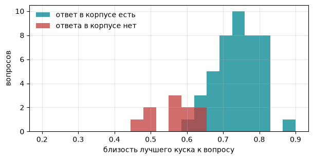


## Память

У модели памяти нет: помнит ваш код, который кладёт нужное в контекст.

Эпизодическая: журнал всех реплик в файле, в контекст он не идёт. Семантическая: короткие факты о пользователе, которые дешёвая модель извлекает из диалога отдельным вызовом. Она возвращает обновлённый список целиком, поэтому «переехал», «передумал», «больше не интересуюсь» заменяют старый факт, а не ложатся рядом с ним.

Факты лежат там же, где знания: в Milvus, отдельной коллекцией. К вопросу достаём не все факты, а три ближайших. В контекст идут системный промпт, эти факты, найденные куски корпуса и окно последних реплик. Вся остальная история остаётся в журнале.

Память помогает и поиску. «Что нового в моих темах?» без фактов не ищется никак, а факты, приклеенные к каждому запросу, портят конкретные вопросы: к вопросу про футбол подмешивается хоккей. Поэтому ищем дважды, по самому вопросу и по вопросу с фактами, и сливаем два списка через `rrf`. Искать имеет смысл только на вопросы: на «привет, я аналитик» база вернёт пять случайных строк, и модель послушно начнёт их пересказывать. Пока это грубая проверка на вопросительный знак


Сделали реплики с использованием памяти и без них

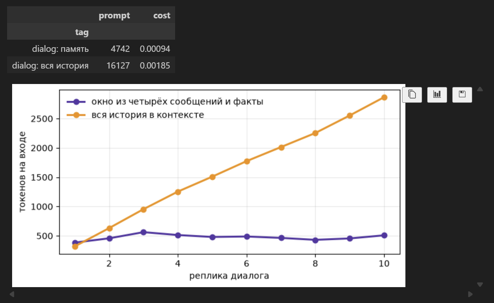

Исходя из графика отчетливо видно, что при хранении всей истории диалога, количество токенов на входе в контексте резко наполняется и мы платим больше нежели когда у нас есть память эпизодическая  и она в контекст не идет и семантическая с фактами + с контекстным окном из 4 сообщений. В конце сессии диалога факты пересобираются


То есть выходит, что подавать в системный промпт инструкции, излвеченные факты из milvus + контекстное окно размером 4 + куски извлеченные RAG выгоднее. Также в конце сессии диалога мы дешевой модели анализируем эпизодическую память (историю диалога), извлекаем факты и перезаписываем их в milvus, делаем пересборку коллекции фактов

Вот несколько фактов из коллекции facts в Milvus

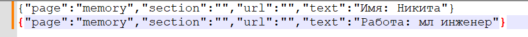


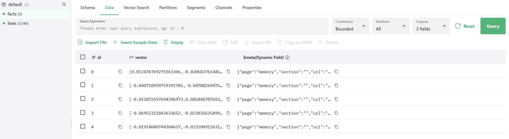


